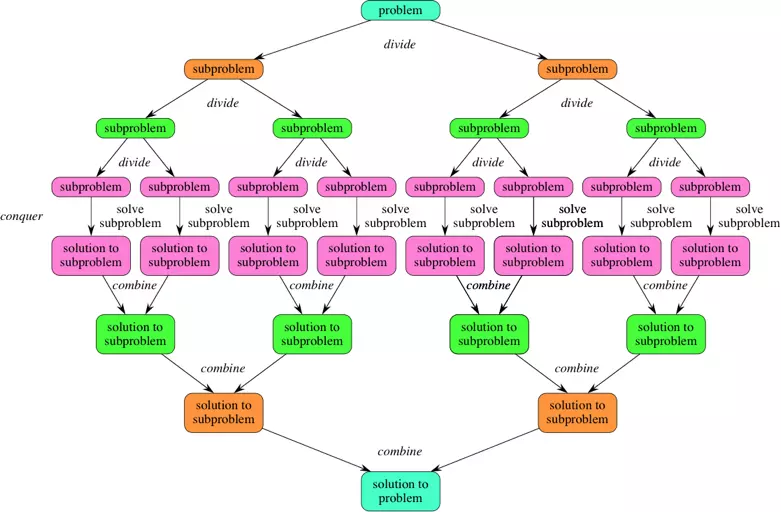
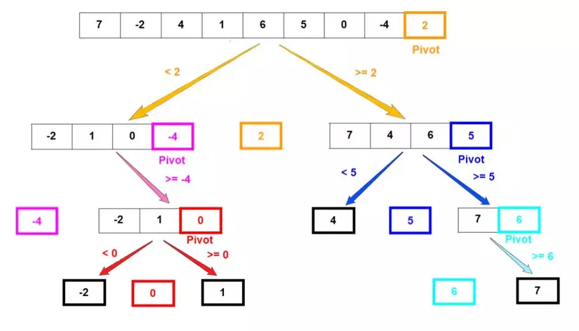
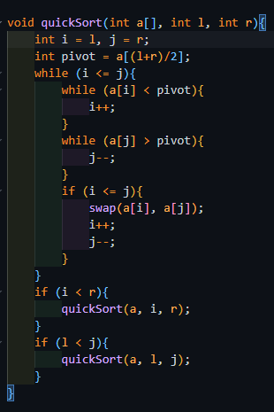
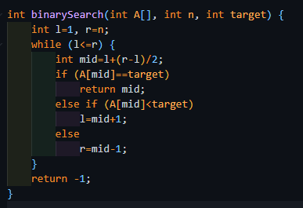

# [ALGORITHM] - BUỔI 1

# QUICK SORT AND BINARY SEARCH

```
Nội dung:
- Khái quát chung về chia để trị.
- Nguyên lý hoạt động của Quick Sort.
- Phần tử pivot là gì? có ảnh hưởng thế nào đến độ phức tạp của thuật toán?
- Tại sao độ phức tạp của Quick Sort lại là O(nlog(n)) và tệ nhất là O(n^2).
- Binary Search hoạt động? tại sao phải so sánh với phần tử chính giữa tập dữ liệu mà không phải lệnh trái hay lệnh phải?
- Độ phức tạp của Binary Search?
- Giải thích code 2 bài : Số bé thứ K, Help sudo trên Codeforces.
```

## I. Khái quát chung về chia để trị

## 1. Định nghĩa

- Mô hình thiết kế thuật toán này hoạt động dựa trên ý tưởng chia vấn đề cần giải quyết thành các vấn đề con cùng dạng với vấn đề đã cho, chỉ khác là cỡ của chúng nhỏ hơn, cứ như vậy lặp lại nhiều lần, cho đến khi bài toán thu được đủ đơn giản để có thể giải quyết trực tiếp. Sau đó, lời giải của các bài toán nhỏ được tổng hợp lại thành lời giải cho bài toán ban đầu.

## 2. Các bước giải

- Chia (divide): Chia bài toán ra thành các bài toán nhỏ hơn (subproblems). Về cơ bản thì những bài toán nhỏ này giống với bài toán ban đầu.
- Trị (conquer): Giải quyết bài toán con trong trường hợp nó đủ nhỏ, còn không thì tiếp tục tiến hành chia tách nó ra thành những bài toán con nhỏ hơn nữa.
- Kết hợp (combine): Kết hợp các kết quả từ bài toán con nhỏ nhất, để ra lời giải cho các bài toán con (subproblems), và cứ thế cuối cùng ra được lời giải cho bài toán ban đầu.

  

## II. Nguyên lý hoạt động của Quick Sort

- Quick Sort chia danh sách cần sắp xếp thành hai danh sách con bằng cách so sánh từng phần tử của danh sách với một phần tử được chọn được gọi là pivot, hay phần tử chốt. Những phần tử nhỏ hơn hoặc bằng pivot được đưa về phía bên trái và nằm trong danh sách con thứ nhất, các phần tử lớn hơn chốt được đưa về phía bên phải và thuộc danh sách đứng sau. Cứ tiếp tục chia như vậy tới khi các danh sách con đều có độ dài bằng 1.
- Cụ thể, Quick Sort sử dụng cách thiết kế chia để trị với các bước như sau:
  - Chọn phần tử pivot. Đây có thể là phần tử ở đầu, ở cuối, hoặc ở giữa của dãy số.
  - Dùng 2 con trỏ chạy từ đầu dãy, và chạy từ cuối dãy. Với con trỏ chạy từ đầu dãy thì dừng lại khi gặp phần tử lớn hơn pivot. Với con trỏ chạy từ cuối dãy thì dừng lại khi gặp phần tử nhỏ hơn pivot. Swap 2 phần tử này với nhau và tiến hành duyệt tiếp. Dừng lại khi con trỏ chạy từ đầu gặp, hoặc vượt qua con trỏ chạy ngược lại từ cuối. Swap pivot vào vị trí hợp lý ta sẽ được 2 dãy con: 1 dãy gồm các phần tử nhỏ hơn pivot, 1 dãy gồm các phần tử lớn hơn pivot. Đây chính là 2 bài toán con mà ta cần tiếp tục giải quyết. Đến đây ta hoàn thành bước chia (divide)
  - Gọi đệ quy để tiếp tục chia nhỏ các bài toán con ra, cho đến khi gặp bài toán con với độ dài là 1, tức ở trạng thái đã được sắp xếp rồi. Đến đây ta hoàn thành bước trị (conquer)
  - Sau khi hoàn thành sắp xếp dãy bên trái nhỏ hơn pivot và dãy bên phải lớn hơn pivote, thì đơn giản ta chỉ cần ghép dãy bên trái, pivote, dãy bên phải về thành 1 mảng là có được kết quả cuối cùng là dãy được sắp xếp.
  
  

### Tại sao độ phức tạp của Quick Sort lại là O(nlog(n)) và tệ nhất là O(n^2)

- Công thức: T(n) = T(k) + T(n-k-1) + θ(n)
- Trong đó, T(k) và T(n-k-1) thời gian dành cho hai cuộc gọi đệ quy. Còn θ(n) là tiến trình phân vùng. k là số phần tử nhỏ hơn phần tử chốt. Thời gian của thuật toán Quick Sort còn phụ thuộc vào mảng đầu và chiến lược chia mảng.
  - Đầu, cuối(xấu nhất): O($n^2$), hai phần là n-1 và 0.
  - Giữa(trung bình): O(nlog(n)), hai phần là n/2 và n-n/2.
- Độ phức tạp là O(n) khi dãy được sắp xếp trước.

### Phần tử pivot

- Là một phần tử được chọn từ dãy số ban đầu để phân chia dãy số thành hai phần.
- Sự lựa chọn của pivot có ảnh hưởng đáng kể đến hiệu suất và độ phức tạp của thuật toán quicksort. Nếu pivot được chọn tốt, thuật toán sẽ hoạt động hiệu quả hơn và độ phức tạp thấp hơn.

  

## III. Nguyên lý hoạt động của Binary Search

- Đúng như tên gọi, thuật toán sẽ liên tục chia không gian tìm kiếm thành hai nửa và loại một nửa đi. Thuật toán có thể trình bày như sau:
  - Ta duy trì một không gian tìm kiếm S là một dãy con các giá trị có thể là kết quả (ở đây là chỉ số các phần tử trong A ). Ban đầu, không gian tìm kiếm là toàn bộ các chỉ số của mảng S=1,…,n với n là chỉ số phần tử cuối cùng của A.
  - Ở mỗi bước, thuật toán so sánh giá trị cần tìm với phần tử có chỉ số là trung vị trong không gian tìm kiếm. Dựa trên sự so sánh đó, cộng thêm việc ta biết dãy A có thứ tự, ta có thể loại một nửa số phần tử của S . Lặp đi lặp lại quá trình này, cuối cùng ta sẽ được một không gian tìm kiếm bao gồm một phần tử duy nhất.
  - Khi đó, nếu phần tử duy nhất đó bằng với giá trị cần tìm x thì đó là nghiệm của bài toán, nếu không thì bài toán vô nghiệm.
- Tại sao phải so sánh với phần tử chính giữa tập dữ liệu mà không phải lệnh trái hay lệnh phải?
  - Chọn bên trái hay phải sẽ có thể gây nên trường hợp xấu nhất phải duyệt cả dạy làm độ phức tạp của thuật toán là O(n).
- Độ phức tạp: O(log(n))

 

## IV. Giải thích 2 bài A và H

### 1. Bài A

#### Sử dụng thuật toán Quick Sort

- Chọn pivot là phần tử tử giữa mảng, tạo 2 biến left và right.
- Đổi chỗ 2 phần tử ở left và right nếu left < rigth mà arr[left] > pivot và arr[right] < pivot. Những phần tử nhỏ hơn hoặc bằng phần tử chốt được đưa về phía trước và nằm trong danh sách con thứ nhất, các phần tử lớn hơn chốt được đưa về phía sau và thuộc danh sách đứng sau. Cứ tiếp tục chia như vậy tới khi các danh sách con đều có độ dài bằng 1.
- Đưa ra phần tử nhỏ thứ k là arr[k].

### 2. Bài H

#### Sử dụng thuật toán Binary Search

- So sánh x với phần tử mid.
- Nếu x trùng phần tử đó, ta trả về vị trí ở giữa.
- Nếu x lớn hơn, ta để left là mid+1 rồi tiếp tục vòng lặp.
- Nếu x nhỏ hơn, ta để right là mid-1 rồi tiếp tục vòng lặp.
- Vòng lặp kết thúc khi 2 biên left >= right.
- Nếu không tìm được x trả về giá trị -1.
- Nếu vị trí tìm kiếm cho kết quả x thì in ra “YES”, nếu không thì in ra “NO”.
