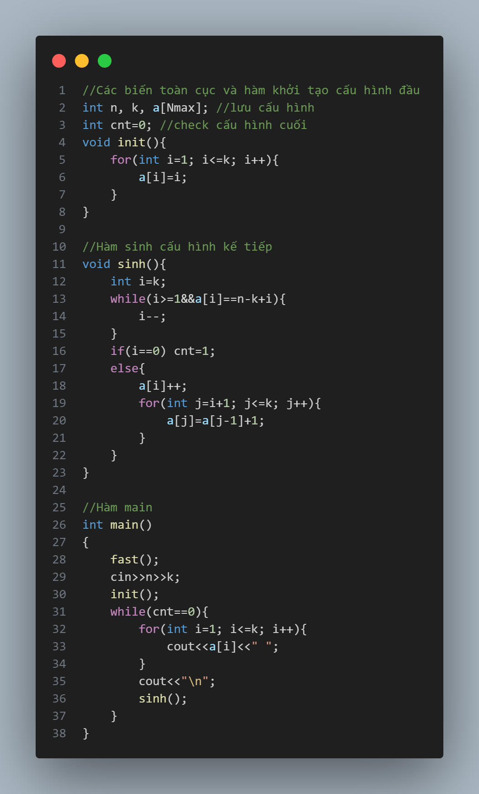

# [ALGORITHM] - BUỔI 2

# THUẬT TOÁN SINH

```
Nội dung:
- 3 thuật toán
  + Sinh nhị phân
  + Sinh tổ hợp
  + Sinh hoán vị
- Yêu cầu chung đối với 3 thuật toán
  + Nguyên lí hoạt động
  + Độ phức tạp
```

## I. Khái quát chung

### 1. Khái niệm

- Thuật toán sinh là một phương pháp được dùng với các bài toán liệt kê và đếm cấu hình để tối ưu cách giải.

### 2. Nguyên lý

- Sinh ra các cấu hình tiếp theo từ cấu hình đầu theo quy luật xác định cho đến cấu hình cuối và không thể sinh tiếp.
- Một chương trình muốn sử dụng được thuật toán sinh phải thỏa mãn được 2 điều kiện:
  - Xác định trình tự, điểm đầu và điểm cuối của tập hợp cấu hình.Điểm đầu có ý nghĩa là cơ sở để hàm sinh chạy được, điểm cuối của tập hợp cấu hình sẽ đảm bảo thuật toán có điểm dừng.
  - Xây dựng được thuật toán mà từ một cấu hình chưa phải cuối thì ta luôn sinh ra một cấu hình kế tiếp nó.

## II. Cấu trúc

``` c++
<Xây dựng cấu hình đầu tiên>;

while(chưa phải cấu hình cuối){
  <Đưa ra cấu hình đang có>;
  <Từ cấu hình đang có sinh ra cấu hình kế tiếp nếu còn>;
}
```

## III. Các phương pháp sinh

### 1. Sinh nhị phân

- Ví dụ : Dãy nhị phân độ dài 3 bao gồm {000,001,010,011,100,101,110,111}.
- Phân tích vấn đề:
  - Ta nhận thấy: Số chuỗi nhị phân sinh ra được là $2^n$, chuỗi đầu tiên là 00...0 và chuỗi cuối cùng là 11...1.
  - Nhận thấy nếu chuỗi hiện tại chưa phải chuỗi cuối cùng cần liệt kê thì chuỗi tiếp theo sẽ bằng chuỗi hiện tại cộng thêm một (theo hệ cơ số 2 có nhớ).
  - Phương pháp sinh được áp dụng cho bài này như sau: Xét từ cuối dãy lên gặp số 0 đầu tiên ta thay số 0 đó bằng số 1 và đặt tất cả các phần tử sau nó là 0 làm như vậy cho tới khi không tìm thấy số 0 nào (cấu hình cuối cùng).
- Thuật toán:
  - Bước 1: Khởi tạo cấu hình ban đầu : 000...0 (n số 0)
  - Bước 2: Xét từ cuối dãy về đầu, gặp số 0 đầu tiên thì thay nó bằng số 1 và đặt tất cả các phần tử phía sau vị trí đó bằng 0.
  - Bước 3: In cấu hình và quay lại bước 2.Sinh cho đến khi gặp cấu hình cuối : 111...1 (n số 1) thì kết thúc quá trình sinh.
- Độ phức tạp để sinh ra tất cả các dãy nhị phân độ dài n sẽ là số lượng cấu hình: $2^n$.
- Code:

  

### 2. Sinh tổ hợp

- Tổ hợp : Là các tập con k phần tử của n phần tử ban đầu,không có sự phân biệt về thứ tự.
- Sinh tổ hợp : Là tạo ra tất cả các tổ hợp (Tập con có k phần tử) của một tập hợp n phần tử.Vì mỗi tổ hợp là một tập hợp con, do đó việc liệt kê tất cả các tổ hợp của một tập hợp tương đương với việc liệt kê tất cả các tập hợp con của 1 tập hợp.
- Ví dụ: Tổ hợp chập 3 của dãy {1,2,3,4} ta có [{1,2,3};{1,2,4};{1,3,4};{2,3,4}]
- Ta có thể tóm tắt lại kĩ thuật sinh tập con kế tiếp từ tập x như sau:
  - Tìm từ cuối dãy lên đầu cho tới khi gặp một phần tử x[i] chưa đạt giới hạn trên n-k+i.
  - Nếu tìm thấy :
    - Tăng x[i] đó lên 1.
    - Đặt tất cả cả các phần tử phía sau x[i] bằng giới hạn dưới.
  - Nếu không tìm thấy tức là mọi phần tử đã đạt giới hạn trên, đây là cấu hình cuối cùng.

- Thuật toán:
  - Bước 1 : Khởi tạo cấu hình ban đầu.
  - Bước 2 : Xét dãy từ cuối lên đầu,tìm phần tử thứ i đầu tiên không thỏa mãn a[i]=n - k + i.Nếu không tìm được,kết thúc quá trình sinh.
  - Bước 3 : Tăng phần tử i lên 1 đơn vị, và từ phần tử i, toàn bộ phần tử sau nó có dạng a[i+1] = a[i] + 1 cho đến phần tử cuối. In cấu hình và quay lại bước 2.
- Độ phức tạp để sinh ra tất cả các tổ hợp chập k của n là số lượng cấu hình: $C^k_n$.
- Code:

 

### 3. Sinh hoán vị

- Một hoán vị là một dãy có thứ tự chứa mỗi phần tử của một tập hợp một và đúng một lần.
- Điểm khác nhau cơ bản giữa một hoán vị và một tập hợp là: những phần tử của một hoán vị được sắp xếp theo một thứ tự xác định.
- Ví dụ: Liệt kê các hoán vị của {1, 2, ..., n} theo thứ tự từ điển, với n=3 ta có các hoán vị {123,132,213,231,312,321}.
- Kĩ thuật sinh hoán vị kế tiếp từ hoán vị hiện tại được xây dựng như sau :
  - Xác định đoạn cuối giảm dần dài nhất, tìm chỉ số i của phần tử x[i] đứng liền trước đoạn cuối đó. Điều này đồng nghĩa với việc tìm từ vị trí sát cuối lên đầu, gặp chỉ số đầu tiên thỏa mãn x[i]<x[i+1] .
  - Nếu tìm thấy chỉ số i như trên
    - Trong đoạn cuối giảm dần, tìm phần tử x[k] nhỏ nhất thỏa mãn điều kiện x[k] >x[i].
    - Đảo giá trị x[k] và x[i]
    - Sắp xếp đoạn cuối trở thành tăng dần
  - Nếu không tìm thấy tức là toàn dãy đã sắp xếp giảm dần, đây là cấu hình cuối cùng.
- Thuật toán:
  - Bước 1 : Khởi tạo cấu hình ban đầu : 1,2,3,..n.
  - Bước 2 : Xét từ cuối dãy lên đầu dãy, tìm phần tử đầu tiên làm mất tính không giảm của dãy, đánh dấu phần tử đó. Nếu không tìm được,kết thúc quá trình sinh.
  - Bước 3 : Xét từ cuối lên đầu dãy,tìm phần tử đầu tiên lớn hơn phần tử được đánh dấu, đổi chỗ 2 phần tử đó.
  - Bước 4 : Từ vị trí phần tử tìm được ở bước 2, sắp xếp tăng dần từ vị trí đó cho đến cuối dãy. In cấu hình và quay lại bước 2.
- Độ phức tạp để sinh ra toàn bộ hoán vị của dãy n phần tử sẽ là số lượng cấu hình: n!

- Code:

  
