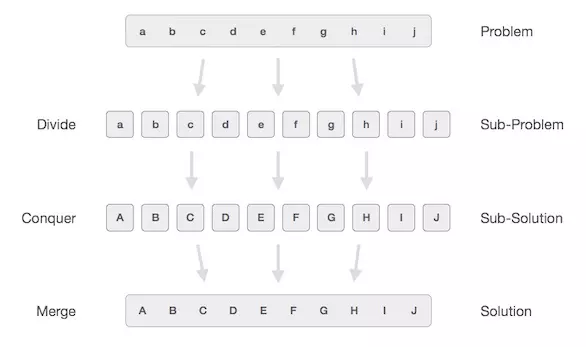

# [ALGORITHM] - BUỔI 3

# CHIA ĐỂ TRỊ (DIVIDE AND CONQUER)

```
Nội dung:
- Khái quát chung về ý tưởng thuật toán chia và trị.
- Các bước thực hiện bài toán.
- Mô phỏng nguyên lý hoạt động của thuật toán.
```

## I. Khái quát chung về ý tưởng thuật toán chia và trị

- Chia để trị là một mô hình thiết kế thuật toán quan trọng, hoạt động dựa trên ý tưởng chia vấn đề cần giải quyết thành các vấn đề con cùng dạng với vấn đề đã cho, chỉ khác là cỡ của chúng nhỏ hơn, cứ như vậy lặp lại nhiều lần, cho đến khi bài toán thu được đủ đơn giản để có thể giải quyết trực tiếp. Sau đó, lời giải của các bài toán nhỏ được tổng hợp lại thành lời giải cho bài toán ban đầu.

## II. Các bước thực hiện bài toán

- **Chia (divide)**: Chia bài toán ra thành các bài toán nhỏ hơn (subproblems). Về cơ bản thì những bài toán nhỏ này giống với bài toán ban đầu.
- **Trị (conquer)**: Giải quyết bài toán con trong trường hợp nó đủ nhỏ, còn không thì tiếp tục tiến hành chia tách nó ra thành những bài toán con nhỏ hơn nữa.
- **Kết hợp (combine)**: Kết hợp các kết quả từ bài toán con nhỏ nhất, để ra lời giải cho các bài toán con (subproblems), và cứ thế cuối cùng ra được lời giải cho bài toán ban đầu.

    

## III. Mô phỏng nguyên lý hoạt động của thuật toán

- Thuật toán chia để trị thường được áp dụng trong nhiều thuật toán khác như Quicksort , Binary search , tính lũy thừa , …
- Ví dụ về tính lũy thừa: Cho 2 số nguyên dương N, K. Tính NK modulo 1e9+7. Biết rằng NK có thể viết dưới dạng:
  
  - $N^K$ = $(N^{K/2})^2$ = $(N^{K/2})*(N^{K/2})$ nếu K chia hết cho 2.
  - $N^K$ = $N*(N^{K/2})^2$ = $N*(N^{K/2})*(N^{K/2})$ nếu K không chia hết cho 2.
  - $N^K$ = 1 nếu K = 0

- Chia nhỏ đến khi bài toán trở về với K = 0. Lúc đó sẽ giải được kết quả bài toán con là 1. Sử dụng đệ quy để trả về kết quả bài toán ban đầu.

    ```c++
    #include<bits/stdc++.h>
    using namespace std;
    ll MOD = 1e9 + 7;

    ll power(ll n, ll k){
        if (k == 0) return 1;
        else
            ll x = power(n, k/2) % MOD;
            if (k % 2 == 0)
                return (x * x) % MOD;
            else
                return ((n % MOD) * (x * x) % MOD) % MOD;
    }

    int main(){
        int t;
        cin>>t;
        while(t–-){
            ll n, k;
            cin>>n>>k;
            cout<<power(n, k)<<”\n”;
        }
    }
    ```

- Độ phức tạp của thuật toán: $O(log_2k)$.
