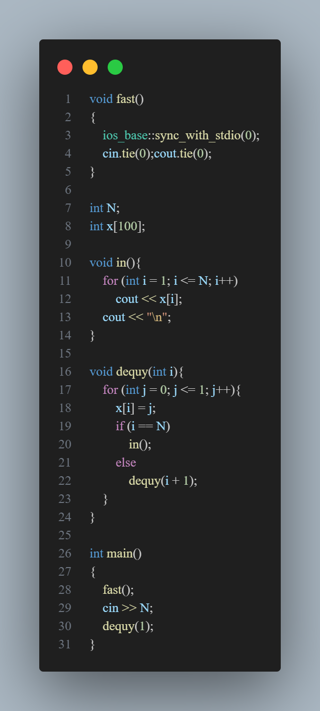
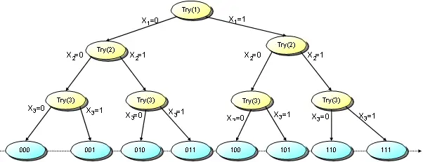

# [ALGORITHM] - BUỔI 4

# ĐỆ QUY QUAY LUI VÀ KỸ THUẬT NHÁNH CẬN

## I. Đệ quy quay lui

### 1. Khái niệm về đệ quy

- Một đối tượng được gọi là đệ quy nếu nó được mô tả thông qua định nghĩa của chính nó. Nghĩa là, các đối tượng này được định nghĩa một cách quy nạp từ những khái niệm đơn giản nhất cùng dạng với nó.
- Những bài toán đệ quy có thể được phân rã thành các bài toán nhỏ hơn, đơn giản hơn nhưng có cùng dạng với bài toán ban đầu. Những bài toán nhỏ lại được phân rã thành các bài toán nhỏ hơn. Cứ như vậy, việc phân rã chỉ dừng lại khi bài toán con đơn giản đến mức có thể suy ra ngay kết quả mà không cần phải phân rã nữa. Ta phải giải tất cả các bài toán con rồi kết hợp các kết quả đó lại để có được lời giải cho bài toán lớn ban đầu. 
- Cách phân rã bài toán như vậy gọi là “chia để trị” (divide and conquer), là một dạng của đệ quy.
- Ví dụ:
  - Tính n! (giai thừa)
    0! = 1;
    n! = n*(n-1)!;
  - Tính 10!:
    10! = 10.9! => tính 9!
    9! = 9.8! => tính 8!
    ...
    2! = 2.1! => tính 1!
    1! = 1.0! => tính 0!
    0! = 1
    => tính đc 1! => 2! => … =>8! =>9! => 10!

- Hàm hay thủ tục đệ quy gồm 2 phần:
  - Phần neo: bài toán con nhỏ nhất, đơn giản nhất, có thể giải trực tiếp không cần qua một bài toán con nào cả
  - Phần đệ quy: nếu bài toán hiện tại chưa thể giải được nhờ phần neo, thì ta xác định bài toán con của nó và gọi đệ quy để giải bài toán con đó, sau khi có lời giải của các bài toán con rồi thì phối hợp lại để giải bài toán hiện tại.
- Phần đệ quy thể hiện tính quy nạp của lời giải. Phần neo thể hiện tính dừng của lời giải (do khi gặp phần neo, lời giải sẽ dừng lại không đi sâu thêm).

### 2. Giới thiệu quay lui

- Quy lui là một kĩ thuật thiết kế giải thuật dựa trên đệ quy bằng cách thử và sửa sai. Ý tưởng của quay lui là tìm lời giải từng bước, mỗi bước chọn một trong số các lựa chọn khả dĩ và đệ quy.
- Kỹ thuật này thường được sử dụng với những bài có giới hạn nhỏ. Các dạng bài quay lui thưởng gặp là tìm:
- Tính Tất cả các cấu hình hoặc một tập các cấu hình thỏa mãn một yêu cầu.
  - Cấu hình tốt nhất theo một tiêu chí nào đó.
- Giả sử cấu hình cần liệt kê có dạng x[1..n], khi đó thuật toán quay lui thực hiện qua các bước:
  - 1 Xét tất cả các giá trị x[1] có thể nhận, thử cho x[1] nhận lần lượt các giá trị đó. Với mỗi giá trị thử gán cho x[1] ta sẽ:
  - 2 Xét tất cả các giá trị x[2] có thể nhận, lại thử cho x[2] nhận lần lượt các giá trị đó. Với mỗi giá trị thử gán cho x[2] ta lại thử các khả năng cho x[3].. cứ tiếp tục như vậy đến bước:
  - ...

  - n Xét tất cả các giá trị x[n] có thể nhận, thử cho x[n] nhận lần lượt các giá trị đó, thông báo cấu hình tìm được (x[1], x[2],..., x[n]).

- Độ phức tạp: sẽ bằng số cấu hình có thể xảy ra của bài toán.

- Mô hình:

    ```c++
    void Try(int i){
        for (mọi giá trị j có thể gán cho x[i]){
            <thử cho x[i] = j>;
            <đánh dấu đã chọn x[i] nếu cần>;
            if (x[i] là phần tử cuối của cấu hình) {
                <thông báo cấu hình tìm được>;
            }
            else Try(i+1);//gọi đệ quy để chọn tiếp x[i+1]
                <xóa đánh dấu đã chọn x[i] nếu cần>;
        }
    }
    ```

- Ví dụ: Liệt kê các dãy nhị phân độ dài n
  
  

  - Có thể mô phỏng quá trình Try bằng cây sau với n = 3:
  
  

  - Ví dụ với 2 cấu hình đầu tiên: 000 và 001
  - Gọi Try(1): gán x[1] = 0-> đi sâu gọi Try(2), gán x[2] = 0 -> đi sâu gọi Try(3), gán x[3]=0-> (i==n) nên in ra cấu hình 000.
  - Bây giờ quay lui lại Try(2) tiếp tục thực hiện vòng for còn dở, gán x[2] = 1 => đi sâu gọi Try(3) -> gán x[3]=0-> (i==n) nên in ra cấu hình 010.
  - Tương tự với các cấu hình còn lại.

## II. Kỹ thuật nhánh cận

- Phương pháp nhánh và cận chính là phương pháp cải tiến từ phương pháp quay lui, được sử dụng để tìm nghiệm của bài toán tối ưu.
- Ta thấy ở thuật toán quay lui, chúng ta sẽ liệt kê toàn bộ cấu hình có thể có. Ví dụ như sinh dãy nhị phân độ dài n, với n = 30, số cấu hình có thể là $2^{30}$ tầm khoảng hơn 1 tỷ cấu hình. Sinh hoán vị với n = 13, số cấu hình là 13! tầm khoảng hơn 6 tỷ cấu hình.
=> Cần phải có phương pháp đánh giá ngay tại thời điểm quyết định chọn x[i], nếu chọn x[i] là thừa, nghĩa là các x[i+1], x[i+2],.. dù có chọn thế nào thì cấu hình hiện tại vẫn không khả quan, thì sẽ không chọn x[i] nữa.
- Khi đó, ta cần tận dụng những thông tin đã tìm được để loại bỏ sớm những phương án chắc chắn không phải tối ưu. Kỹ thuật đó gọi là kỹ thuật đánh giá nhánh cận trong tiến trình quay lui.
- Mô hình:

    ```c++
    void tim(int i)
    {
        for( Các giá trị j có thể gán cho x[i])
        {
            x[i]=j;
            if(Việc thử trên vẫn còn hi vọng tìm ra cấu hình tốt hơn BESTCONFIG)
            { 
                if (x[i] là phần tử cuối cùng)
                    Cập nhật lại BESTCONFIG
                else
                {
                    Ghi nhận việc thử x[i]=j nếu cần
                    tim(i+1);
                    Bỏ ghi nhận việc thử x[i]=j nếu cần
                }
            }
        }
    }
    ```

- Kỹ thuật nhánh cận thêm vào cho thuật toán quay lui khả năng đánh giá theo từng bước, nếu tại bước thứ i, giá trị thử gán cho x[i] không có hi vọng tìm thấy cấu hình tốt hơn BESTCONFIG thì thử ngay giá trị khác mà không cần phải gọi đệ quy tìm tiếp hay ghi nhận kết quả. Nghiệm của bài toán sẽ được làm tốt dần, vì khi tìm ra một cấu hình mới tốt hơn thì BESTCONFIG sẽ được cập nhật lại bằng cấu hình đó.
- Độ phức tạp thuật toán: độ phức tạp tối đa sẽ là độ phức tạp khi sử dụng quay lui.
