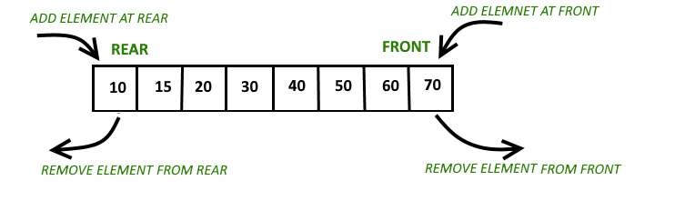
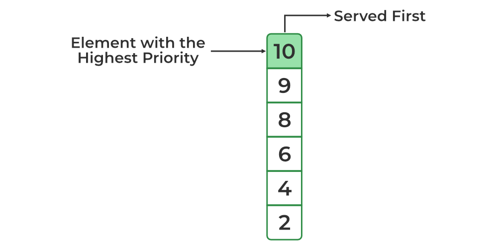

# [ALGORITHM] - BUỔI 6

# QUEUE, DEQUE, PRIORITY QUEUE

```
Nội dung:
- Chuẩn bị bài tập sau:
    + https://www.spoj.com/PTIT/problems/BCQUEUE/
    + Bài E contest codeforces.
- Tài liệu tham khảo trên Youtube CLB:
    + https://www.youtube.com/watch?v=UFID9WPAEjI
    + https://www.youtube.com/watch?v=u8SmuluP-ww
    + https://www.youtube.com/watch?v=3gCEqTRcfTE
- Queue, deque, priority queue và các bài toán liên quan:
    + Tìm hiểu cách hoạt động của queue, các thao tác trên queue, độ phức tạp của các thao tác.
    + Tìm hiểu cách hoạt động của deque, các thao tác trên deque, độ phức tạp của các thao tác.
    + Tìm hiểu cách hoạt động của priority queue, các thao tác trên priority queue, độ phức tạp của các thao tác.
    + Chỉ ra các ứng dụng của queue
```

## I. Tìm hiểu chung về Queue

 

- Là một cấu trúc dữ liệu hàng đợi dùng để lưu giữ các đối tượng theo cơ chế **FIFO** (viết tắt từ tiếng Anh: First In First Out), nghĩa là “vào trước ra trước”.
- Các thao tác trên queue
    a. Hàm `push(…)` để thêm 1 phần tử vào trong queue.
    b. Hàm `pop()` để xóa phần tử ở đầu queue.
    c. Hàm `front()` để lấy phần tử ở đầu queue.
    d. Hàm `back()` để lấy phần tử ở cuối queue.
    e. Hàm `size()` để lấy số lượng phần tử ở trong queue.
    f. Hàm `empty()` trả về 1 nếu queue rỗng, 0 nếu ngược lại.

- Các thao tác đều có độ phức tạp là O(1).

## II. Tìm hiểu chung về Deque



- Là cấu trúc dữ liệu chứa 0 hoặc nhiều phần tử có cùng kiểu dữ liệu và được biểu diễn bằng một hàng có phần tử đầu (front) và phần tử cuối (last).Có thể nói deque **là kết hợp giữa queue và stack** khi phần đầu của deque hoạt động theo quy tắc FIFO còn đầu sau là LIFO.
- Các thao tác trên deque
    a. Hàm `push_back()` để thêm 1 phần tử vào cuối deque.
    b. Hàm `push_front()` để thêm 1 phần tử vào đầu deque.
    c. Hàm `pop_back()` để bỏ đi 1 phần tử ở cuối deque.
    d. Hàm `pop_front()` để bỏ đi 1 phần tử ở đầu deque.
    e. Hàm `front()` để trả về giá trị đầu của deque.
    f. Hàm `back()` để trả về giá trị cuối của deque.
    g. Hàm `size()` để trả về số lượng phần tử trong deque.
    h. Hàm `empty()` trả về 1 nếu deque rỗng, 0 nếu ngược lại.
    i. Hàm `clear()` để xóa toàn bộ deque.
- Độ phức tạp của các thao tác đều là O(1).

## III. Tìm hiểu chung về Priority Queue



- Priority queue hoạt động giống như 1 **hàng đợi ưu tiên** (mỗi 1 phần tử sẽ có 1 độ ưu tiên nhất định).
- Ví dụ:
  - `priority_queue<int> pq`: các phần tử trong priority_queue sẽ sắp xếp giảm dần.
  - `priority_queue <int, vector<int>, greater<int>> pq`: các phần tử trong priority_queue sẽ sắp xếp tăng dần.
- Phần tử có độ ưu tiên cao hơn sẽ được loại bỏ trước phần tử có độ ưu tiên thấp hơn khi pop.
- Nếu cùng độ ưu tiên thì thứ tự xử lí sẽ phụ thuộc vào thứ tự trong queue.
- Các thao tác trong priority queue(pq)
    a. Hàm `empty()` trả về 1 nếu pq rỗng, 0 nếu ngược lại.
    b. Hàm `size()` trả về số lượng phần tử trong pq.
    c. Hàm `push()` để chèn 1 phần tủ vào trong pq. Đầu tiên, phần tử này sẽ đứng cuối hàng đợi, sau đó các phần tử sẽ được sắp xếp lại theo độ ưu tiên.
    d. Hàm `pop()` để xóa phần tử trên cùng của pq.
    e. Hàm `top()` trả về phần tử trên cùng của pq hay phần tử có độ ưu tiên cao nhất.
    f. Hàm `swap()` để hoán đổi các phần tử cẩu 1 pq này với 1 pq khác cùng kích thước và cùng kiểu dữ liệu.
- Độ phức tạp của hàm `push()` và `pop()` là O(log n), còn lại đều à O(1).

## IV. Các ứng dụng của queue

- Xử lý các lệnh trong máy tính (ứng dụng trong hệ điều hành, trình biên dịch), hàng đợi các tiến trình chờ được xử lý.
