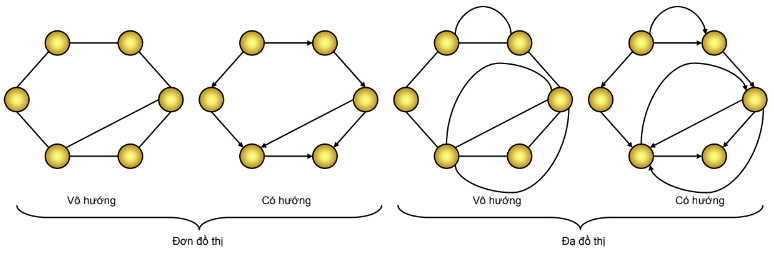
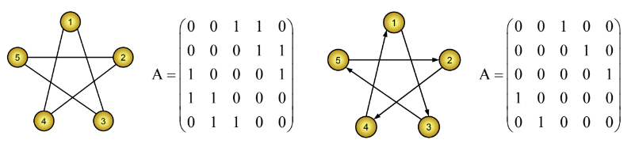
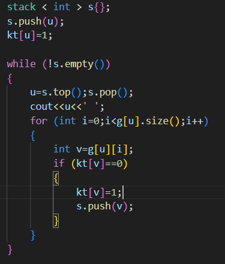
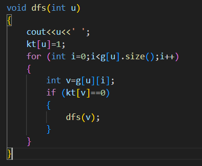
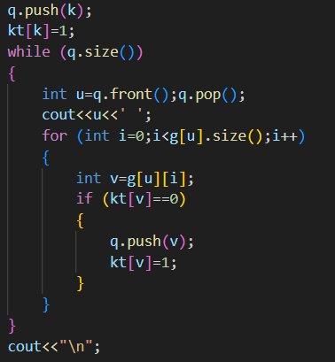

# [ALGORITHM] - BUỔI 7

# GRAPH

```
Nội dung:
- Chuẩn bị bài tập sau:
    + F - DFS trên đồ thị vô hướng
    + G - BFS trên đồ thị có hướng
- Dàn ý chuẩn bị:
    + Các khái niệm cơ bản của đồ thị
        Định nghĩa cơ bản của đồ thị
          Đồ thị là gì ?
          Đơn đồ thị
          Đa đồ thị
          Đồ thị có hướng
          Đồ thị vô hướng
        Các khái niệm
          Cạnh liên thuộc
          Khuyên 
          Đỉnh kề
          Bậc 
        Một vài ví dụ thực tế
    + Biểu diễn đồ thị trên máy tính
        Ma trận kề
        Danh sách kề
        Danh sách cạnh
        Ưu nhược điểm của các cách  biểu diễn trên
    + Các thuật toán tìm kiếm trên đồ thị
        Khái niệm
          Đường đi
          Chu trình
          Đường đi đơn
          Chu trình đơn
        Tìm kiếm theo chiều sâu (DFS)
          Lý thuyết
          Cài đặt không đệ quy
          Cài đặt đệ quy
        Tìm kiếm theo chiều rộng (BFS)
          Lý thuyết
          Thuật toán loang
          Cài đặt bằng queue
        Độ phức tạp của DFS và BFS
    + Tính liên thông của đồ thị
        Các định nghĩa trong đồ thị vô  hướng
        Các định nghĩa trong đồ thị vô hướng
          Liên thông, thành phần liên thông
          Cạnh cầu
          Khớp (đỉnh trụ)
        Định nghĩa trong đồ thị có hướng
          Liên thông mạnh
          Liên thông yếu
        Code đếm thành phần liên thông
          Dùng BFS hoặc DFS
```

## I. Lý thuyết cơ bản về đồ thị

### 1. Định nghĩa đồ thị

- Đồ thị là gì ?
Đồ thị (GRAPH) là một cấu trúc rời rạc gồm các đỉnh và các cạnh nối các đỉnh đó. Được mô tả: G = (V,E)
Trong đó V là tập hợp các đỉnh, E là tập hợp các cạnh – các đường nối giữa các cặp đỉnh.
- Đơn đồ thị: là đồ thị mà giữa hai đỉnh u, v của V có nhiều nhất 1 cạnh trong E nối từ u đến v.
- Đa đồ thị: là đồ thị mà giữa hai đỉnh u, v của V có nhiều hơn 1 cạnh trong E nối từ u đến v.
- Đồ thị có hướng: là một đồ thị mà các cạnh trong E là có định hướng, có thể có cạnh nối từ đỉnh u đến đỉnh v nhưng chưa chắc đã có cạnh nối từ v đến u. Hay nói cách khác, tập E gồm các cặp (u, v) có tính thứ tự. (u, v)  (v, u).
- Đồ thị vô hướng: là một đồ thị mà các cạnh trong E là không định hướng, tức là cạnh nối hai đỉnh u, v bất kì cũng là cạnh nối hai đỉnh v, u. Hay nói cách khác, tập E gồm các cặp (u, v) không tính thứ tự. (u, v)  (v, u).



### 2. Các khái niệm

- Với mỗi cạnh e = (u,v) ∈ E thì ta nói đỉnh u và đỉnh v kề nhau, và e là cạnh liên thuộc giữa 2 đỉnh u và v.
- Bậc của đỉnh v ∈ V ký hiệu deg(v) được tính bằng số cạnh liên thuộc với đỉnh v trong đồ thị. Trong đơn đồ thị, số đỉnh kề với v cũng chính bằng số cạnh liên thuộc với v và bằng với bậc của v.
- Khuyên là một cạnh (vô hướng hoặc có hướng) nối từ một đỉnh về chính nó.

### 3. Một vài ví dụ thực tế

- Đồ thị với các thành phố là các đỉnh, các cạnh là các đường đi giữa các thành phố.

## II. Biểu diễn đồ thị trên máy tính

### Ma trận kề

- Giả sử G = (V, E) là một đơn đồ thị có số đỉnh (ký hiệu ⏐V⏐) là n, Không mất tính tổng quát có thể coi các đỉnh được đánh số 1, 2, ..., n. Khi đó ta có thể biểu diễn đồ thị bằng một ma trận vuông A = [a[i, j]] cấp n. Trong đó:
  - a[i, j] = 1 nếu (i, j) ∈ E
  - a[i, j] = 0 nếu (i, j) ∉ E
- Với ∀i, giá trị của a[i, i] có thể đặt tuỳ theo mục đích, thông thường nên đặt bằng 0;
- Đối với đa đồ thị thì việc biểu diễn cũng tương tự trên, chỉ có điều nếu như (i, j) là cạnh thì không phải ta ghi số 1 vào vị trí a[i, j] mà là ghi số cạnh nối giữa đỉnh i và đỉnh j.



- Các tính chất của ma trận kề:
  - Đối với đồ thị vô hướng G, thì ma trận kề tương ứng là ma trận đối xứng (a[i, j] = a[j, i]), điều này không đúng với đồ thị có hướng.
  - Nếu G là đồ thị vô hướng và A là ma trận kề tương ứng thì trên ma trận A: *Tổng các số trên hàng i = Tổng các số trên cột i = Bậc của đỉnh i = deg(i)*
  - Nếu G là đồ thị có hướng và A là ma trận kề tương ứng thì trên ma trận A: *Tổng các số trên hàng i = Bán bậc ra của đỉnh i = deg+(i). Tổng các số trên cột i = Bán bậc vào của đỉnh i = deg-(i)*
  - Trong trường hợp G là đơn đồ thị, ta có thể biểu diễn ma trận kề A tương ứng là các phần tử logic. a[i, j] = TRUE nếu (i, j) ∈ E và a[i,j] = FALSE nếu (i, j) ∉ E
- Ưu điểm của ma trận kề:
  - Đơn giản, trực quan, dễ cài đặt trên máy tính
  - Để kiểm tra xem hai đỉnh (u, v) của đồ thị có kề nhau hay không, ta chỉ việc kiểm tra bằng một phép so sánh: a[u, v] ≠ 0.
- Nhược điểm của ma trận kề:
  - Bất kể số cạnh của đồ thị là nhiều hay ít, ma trận kề luôn luôn đòi hỏi n2 ô nhớ để lưu các phần tử ma trận, điều đó gây lãng phí bộ nhớ dẫn tới việc không thể biểu diễn được đồ thị với số đỉnh lớn.
  - Với một đỉnh u bất kỳ của đồ thị, nhiều khi ta phải xét tất cả các đỉnh v khác kề với nó, hoặc xét tất cả các cạnh liên thuộc với nó. Trên ma trận kề việc đó được thực hiện bằng cách xét tất cả các đỉnh v và kiểm tra điều kiện a[u, v] ≠ 0. Như vậy, ngay cả khi đỉnh u là đỉnh cô lập (không kề với đỉnh nào) hoặc đỉnh treo (chỉ kề với 1 đỉnh) ta cũng buộc phải xét tất cả các đỉnh và kiểm tra điều kiện trên dẫn tới lãng phí thời gian.

### Danh sách kề

- Để khắc phục nhược điểm của các phương pháp ma trận kề và danh sách cạnh, người ta đề xuất phương pháp biểu diễn đồ thị bằng danh sách kề. Trong cách biểu diễn này, với mỗi đỉnh v của đồ thị, ta cho tương ứng với nó một danh sách các đỉnh kề với v.
- Với đồ thị G = (V, E). V gồm n đỉnh và E gồm m cạnh. Có hai cách cài đặt danh sách kề phổ biến:
  - Cách 1: Dùng một mảng các đỉnh, mảng đó chia làm n đoạn, đoạn thứ i trong mảng lưu danh sách các đỉnh kề với đỉnh i. Để biết một đoạn nằm từ chỉ số nào đến chỉ số nào, ta có một mảng Head lưu vị trí riêng. Head[i] sẽ bằng chỉ số đứng liền trước đoạn thứ i. Quy ước Head[n + 1] bằng m.
  - Cách 2: Dùng các danh sách móc nối: Với mỗi đỉnh i của đồ thị, ta cho tương ứng với nó một danh sách móc nối các đỉnh kề với i, có nghĩa là tương ứng với một đỉnh i, ta phải lưu lại List[i] là chốt của một danh sách móc nối.
- Ưu điểm của danh sách kề:
  - Đối với danh sách kề, việc duyệt tất cả các đỉnh kề với một đỉnh v cho trước là hết sức dễ dàng, cái tên "danh sách kề" đã cho thấy rõ điều này. Việc duyệt tất cả các cạnh cũng đơn giản vì một cạnh thực ra là nối một đỉnh với một đỉnh khác kề nó.
- Nhược điểm của danh sách kề:
  - Danh sách kề yếu hơn ma trận kề ở việc kiểm tra (u, v) có phải là cạnh hay không, bởi trong cách biểu diễn này ta sẽ phải việc phải duyệt toàn bộ danh sách kề của u hay danh sách kề của v.

### Danh sách cạnh

- Trong trường hợp đồ thị có n đỉnh, m cạnh, ta có thể biểu diễn đồ thị dưới dạng danh sách cạnh bằng cách liệt kê tất cả các cạnh của đồ thị trong một danh sách, mỗi phần tử của danh sách là một cặp (u, v) tương ứng với một cạnh của đồ thị. (Trong trường hợp đồ thị có hướng thì mỗi cặp (u, v) tương ứng với một cung, u là đỉnh đầu và v là đỉnh cuối của cung). Danh sách được lưu trong bộ nhớ dưới dạng mảng hoặc danh sách móc nối.
- Ưu điểm của danh sách cạnh:
  - Trong trường hợp đồ thị thưa (có số cạnh tương đối nhỏ: chẳng hạn m < 6n), cách biểu diễn bằng danh sách cạnh sẽ tiết kiệm được không gian lưu trữ, bởi nó chỉ cần 2m ô nhớ để lưu danh sách cạnh.
  - Trong một số trường hợp, ta phải xét tất cả các cạnh của đồ thị thì cài đặt trên danh sách cạnh làm cho việc duyệt các cạnh dễ dàng hơn. (Thuật toán Kruskal chẳng hạn).
- Nhược điểm của danh sách cạnh:
  - Nhược điểm cơ bản của danh sách cạnh là khi ta cần duyệt tất cả các đỉnh kề với đỉnh v nào đó của đồ thị, thì chẳng có cách nào khác là phải duyệt tất cả các cạnh, lọc ra những cạnh có chứa đỉnh v và xét đỉnh còn lại. Điều đó khá tốn thời gian trong trường hợp đồ thị dày (nhiều cạnh).

## III. Các thuật toán tìm kiếm trên đồ thị

### Khái niệm

- Đường đi: Cho đồ thị G = (V, E). u và v là hai đỉnh của G. Một đường đi (path) độ dài p từ đỉnh s đến đỉnh f là dãy x[0..p] thoả mãn x[0] = s, x[p] = f và (x[i], x[i+1]) ∈ E với ∀i: 0 ≤ i < p. Đường đi nói trên còn có thể biểu diễn bởi dãy các cạnh: (s = x[0], x[1]), (x[1], x[2]), ..., (x[p-1], x[p] = f).
- Chu trình: là đường đi có đỉnh đầu bằng đỉnh cuối.
- Đường đi không có cạnh nào đi qua hơn 1 lần được gọi là đường đi đơn. Tương tự ta sẽ có khái niệm về chu trình đơn.

### Tìm kiếm theo chiều sâu (DFS)

- Lý thuyết
  - Trước hết, mọi đỉnh x kề với S tất nhiên sẽ đến được từ S. Với mỗi đỉnh x kề với S đó thì tất nhiên những đỉnh y kề với x cũng đến được từ S... Điều đó gợi ý cho ta viết một thủ tục đệ quy DFS(u) mô tả việc duyệt từ đỉnh u bằng cách thăm đỉnh u và tiếp tục quá trình duyệt DFS(v) với v là một đỉnh chưa thăm kề với u. Để không một đỉnh nào bị liệt kê tới hai lần, ta sử dụng kỹ thuật đánh dấu, mỗi lần thăm một đỉnh, ta đánh dấu đỉnh đó lại để các bước duyệt đệ quy kế tiếp không duyệt lại đỉnh đó nữa.
  - Để lưu lại đường đi từ đỉnh xuất phát s, trong thủ tục DFS(u), trước khi gọi đệ quy DFS(v) với v là một đỉnh kề với u mà chưa đánh dấu, ta lưu lại vết đường đi từ u tới v bằng cách đặt Trace[v] = u, tức là Trace[v] lưu lại đỉnh liền trước v trong đường đi từ s tới v.
- Cài đặt không đệ quy: dùng Stack

  

- Cài đặt đệ quy:

  

### Tìm kiếm theo chiều rộng (BFS)

- Lý thuyết
  - Cơ sở của phương pháp cài đặt này là "lập lịch" duyệt các đỉnh. Việc thăm một đỉnh sẽ lên lịch duyệt các đỉnh kề nó sao cho thứ tự duyệt là ưu tiên chiều rộng (đỉnh nào gần S hơn sẽ được duyệt trước). 
  - Ví dụ: Bắt đầu ta thăm đỉnh S. Việc thăm đỉnh S sẽ phát sinh thứ tự duyệt những đỉnh (x[1], x[2], ..., x[p]) kề với S (những đỉnh gần S nhất). Khi thăm đỉnh x[1] sẽ lại phát sinh yêu cầu duyệt những đỉnh (u[1], u[2] ..., u[q]) kề với x[1]. Nhưng rõ ràng các đỉnh u này "xa" S hơn những đỉnh x nên chúng chỉ được duyệt khi tất cả những đỉnh x đã duyệt xong. Tức là thứ tự duyệt đỉnh sau khi đã thăm x[1] sẽ là: (x[2], x[3]..., x[p], u[1], u[2], ..., u[q]).
- Thuật toán loang: là một kĩ thuật sử dụng BFS để tìm tất cả các điểm có thể đi tới.
- Cài đặt bằng queue:

  

- Độ phức tạp của DFS và BFS
  - Thuật toán sẽ mất độ phức tạp  O(n + m) với danh sách kề.
  - Thuật toán sẽ mất độ phức tạp O($n^2$) với ma trận kề.
  - Thuật toán sẽ mất độ phức tạp O(n.m) vớidanh sách cạnh.

### Tính liên thông của đồ thị

- Các định nghĩa trong đồ thị vô hướng
  - G gọi là liên thông nếu luôn tồn tại đường đi giữa mọi cặp đỉnh phân biệt của đồ thị. Nếu G không liên thông thì chắc chắn nó sẽ là hợp của hai hay nhiều đồ thị con liên thông, các đồ thị con này đôi một không có đỉnh chung. Các đồ thị con liên thông rời nhau như vậy được gọi là các thành phần liên thông của đồ thị đang xét.
  - Cạnh cầu: là cạnh mà khi ta bỏ cạnh đó đi sẽ thu được đồ thị mới có nhiều thành phần liên thông hơn đồ thị ban đầu.
  - Khớp: là đỉnh mà khi ta bỏ đỉnh đó với các cạnh liên thuộc của đỉnh đó đi sẽ thu được đồ thị mới có nhiều thành phần liên thông hơn đồ thị ban đầu.
- Định nghĩa trong đồ thị có hướng
  - Liên thông mạnh: G gọi là liên thông mạnh nếu luôn tồn tại đường đi (theo các cung định hướng) giữa 2 đỉnh bất kỳ của đồ thị.
  - Liên thông yếu: G được gọi là liên thông yếu nếu đồ thị vô hướng nền của nó liên thông.
- Code đếm thành phần liên thông dùng BFS hoặc DFS:

  ```c++
  #include <bits/stdc++.h>

  #define ll long long
  #define mod 1000000007
  #define endl '\n'
  #define pb push_back
  #define bop pop_back
  #define fast                          \
      ios_base::sync_with_stdio(false); \
      cin.tie(0);                       \
      cout.tie(0);
  #define process       \
      while (t--)       \
      {                 \
          solve();      \
          cout << "\n"; \
      }

  using namespace std;

  const int Nmax = 1e6;

  int kt[Nmax];
  vector< vector < int > > g;
  void dfs(int u)
  {
    kt[u]=1;
    for (int i=0;i<g[u].size();i++)
    {
      int v=g[u][i];
      if (kt[v]==0)
      {
        dfs(v);
      }
    }
  }

  void solve()
  {
    int n,m;
    cin >> n >> m;
    g.resize(n+5);
    for (int i=1;i<=m;i++)
    {
      int u,v;
      cin >> u >> v;
      g[u].pb(v);
      g[v].pb(u);
    }
    int ans=0;
    for (int i=1;i<=n;i++)
    {
      if (kt[i]==0)
      {
        ans++;
        dfs(i);
      }
    }
    cout<<ans;
  }

  int main()
  {
    fast int t = 1;
    //cin >> t;cin.ignore();
    process
  }
  ```
